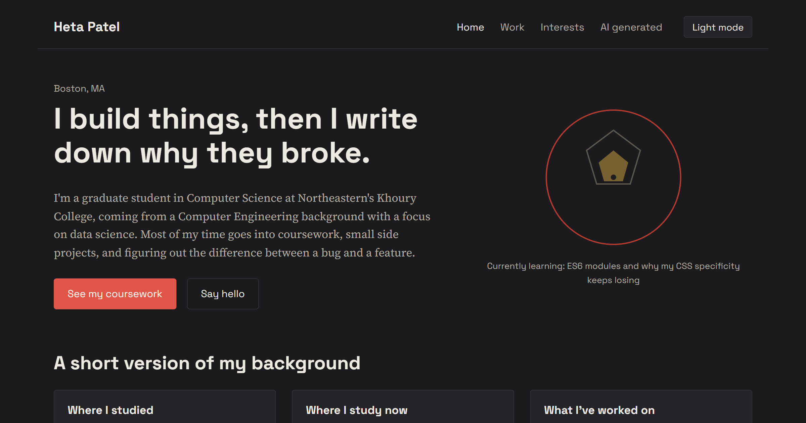

# Heta Patel — Personal Homepage

**Live site:** https://hetapatel0315.github.io/project-1/
**Repository:** https://github.com/hetapatel0315/project-1



## Author

Heta Patel

## Class link

[CS 5610 Web Development, Northeastern University Khoury College] https://johnguerra.co/classes/webDevelopment_online_fall_2026

## Project objective

Project 1 for CS 5610: a front-end-only static personal homepage built with vanilla HTML5, CSS3, and ES6+ JavaScript, deployed as a public page. The site has four pages (Home, Work, Interests, and an AI-generated page), a shared light/dark theme toggle, and an interactive "contact sheet" photo gallery on the Interests page as the original creative component.

## Instructions to build / run locally

1. Clone or download this repository.
2. No build step is required. Open `index.html` directly in a browser, or serve the folder locally:

```
   npx http-server .
```

3. Install dev dependencies (ESLint, Prettier):

```
   npm install
```

4. Lint and format:

```
   npm run lint
   npm run format
```

5. To deploy, push to a public GitHub repository and enable GitHub Pages on the `main` branch (Settings → Pages).

## Project structure

```
personal-homepage/
  index.html
  work.html
  interests.html
  ai-page.html
  css/
    style.css
  js/
    main.js
    theme.js
    contact-sheet.js
  images/
    favicon.svg, aperture.svg, frame-01.svg ... frame-06.svg, og-image.png
    mockups/          (wireframes for the design document)
  design-document.md
  package.json
  eslint.config.js
  .prettierrc.json
  LICENSE
```

## Use of GenAI tools

Generative AI (Claude, Anthropic, via claude.ai, September 2026) was used in building this project, as follows:

- **Scaffolding the site.** I described the assignment rubric and my background, and asked Claude to draft the HTML structure, CSS, and ES6 JavaScript modules for a four-page personal homepage, including a light/dark theme toggle and an interactive photo-gallery component.
- **The AI-generated page.** The content of `ai-page.html` is explicitly AI-written and disclosed on the page itself, per the assignment requirement. Prompt used: "Using my background [background summary], write a short page imagining my homepage ten years from now."
- **Design document.** Claude helped draft the initial personas, user stories, and wireframes in `design-document.md`, which I then reviewed and adjusted.
- **Tooling and deployment help.** Claude helped with ESLint/Prettier setup, HTML validation fixes, and GitHub Pages deployment steps.
- **What I did myself.** I reviewed and edited all generated code and copy, chose the visual direction, deployed the site, and am responsible for the final content submitted.

## License

MIT. See [LICENSE](LICENSE).
